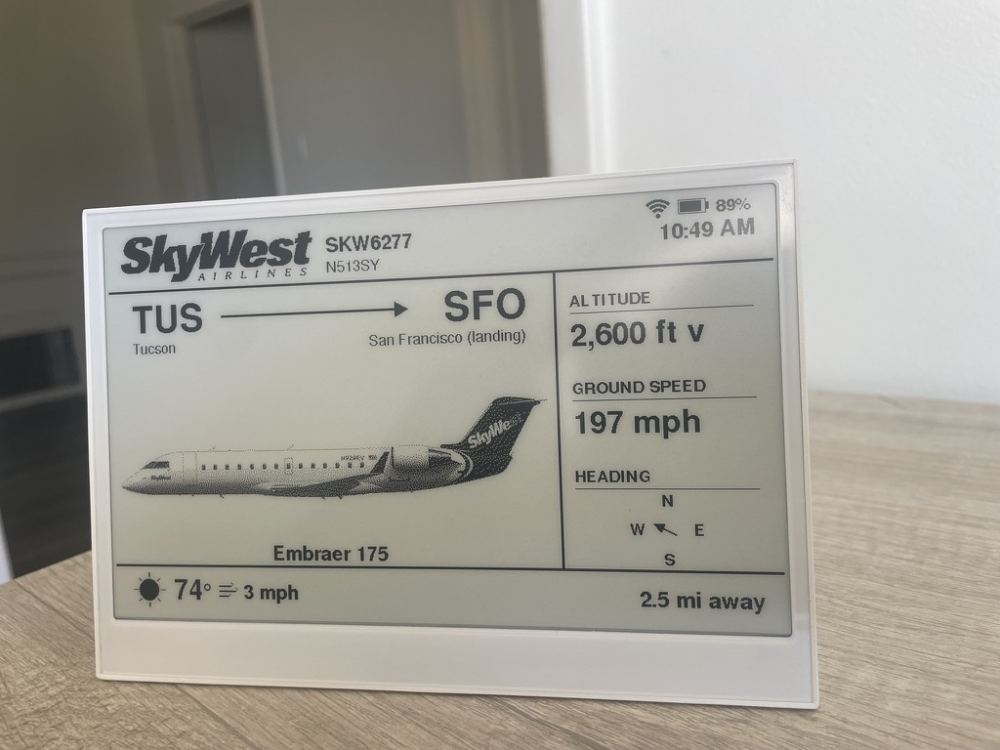
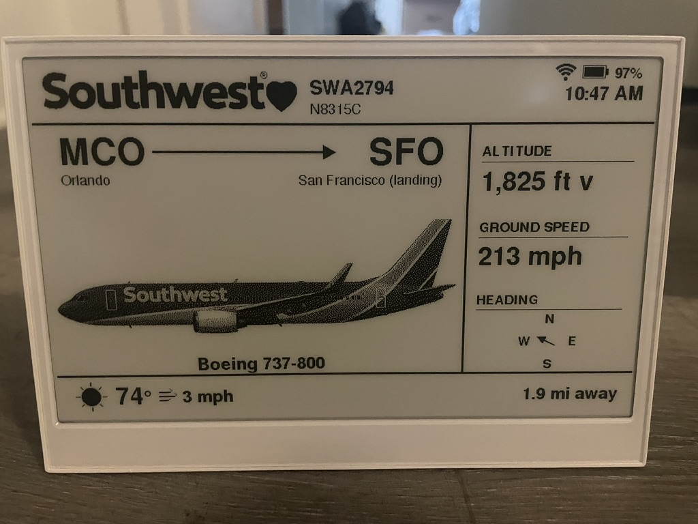
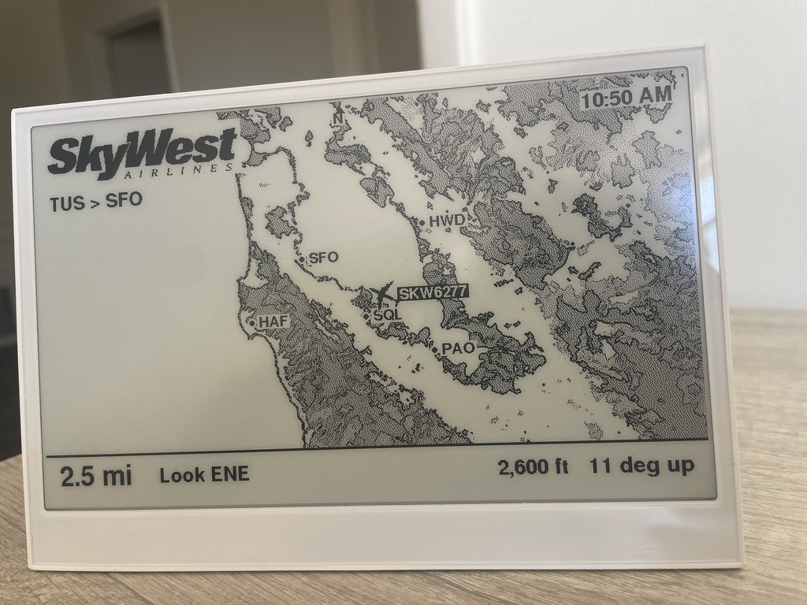

# ✈️ Closest Plane Overhead

A self-contained e-paper device that shows the single aircraft currently
**closest to you overhead** — its route, altitude, ground speed, heading,
aircraft type + silhouette, and a "where to look in the sky" hint (compass
direction + elevation angle).

**All logic runs on the device.** No companion server, no image streaming. The
device connects to WiFi, calls the flight APIs itself, computes the closest
plane, and draws the UI natively to its own e-paper panel.

## Live on the device

Real photos of the firmware running on the reTerminal E1001 panel.

| Details card | Details card |
| :---: | :---: |
|  |  |
| SkyWest **SKW6277** — TUS → SFO (landing), Embraer 175, 2,600 ft descending, 2.5 mi away | Southwest **SWA2794** — MCO → SFO (landing), Boeing 737-800, 1,825 ft descending, 1.9 mi away |

The card shows the airline + callsign + tail number, the route (with the
destination overridden to geometric ground truth on approach), altitude with a
climb/descent arrow, ground speed, a compass heading dial, the aircraft type +
dithered silhouette, local weather, and the straight-line distance overhead.



A second screen plots the plane on a dithered terrain map of the SF Peninsula
with nearby airports (SFO/HWD/PAO/HAF/SQL), and a **"look ENE, 11° up"** hint for
finding it in the sky.

## Hardware

[Seeed Studio reTerminal E1001](https://www.seeedstudio.com/):

- 7.5" ePaper, **800×480**, monochrome / 4-level grayscale
- **ESP32-S3 + 8MB PSRAM**, 32MB flash, 2.4GHz WiFi
- ~3-month battery, USB-C, microSD, temp/humidity sensors, buzzer

Full spec, pin map, and Mac flashing notes are in **[docs/HARDWARE.md](docs/HARDWARE.md)**.

## How it works

On each wake the firmware:

1. **Connects** to WiFi.
2. **Fetches telemetry** — OpenSky `/states/all` for a bounding box around the
   device's fixed lat/lon, filters to airborne, picks the nearest by haversine
   distance.
3. **Enriches** — aircraft type/registration from an on-flash database
   (`acdb.bin`), airline from the callsign prefix, route from adsbdb (fallback).
4. **Computes** — climb/descent, compass bearing, and elevation angle.
5. **Renders** the card directly to the e-paper with GxEPD2 + Adafruit_GFX.
6. **Deep-sleeps** between refreshes (1–5 min) to hit the battery target.

### Data sources (all free)
- **[OpenSky Network](https://opensky-network.org/)** — live position, altitude,
  speed, heading. OAuth2 client-credentials (free account).
- **On-flash aircraft DB** — the OpenSky metadata CSV, preprocessed into a 14MB
  binary (`acdb.bin`) that's binary-searched from LittleFS. No key, no network.
- **[adsbdb.com](https://www.adsbdb.com/)** — route (origin → destination),
  keyless. Used as a fallback; for planes on approach near a known airport the
  destination is overridden with geometric ground truth.

## Firmware

Built with **[PlatformIO](https://platformio.org/)** (Arduino-ESP32 framework).

### Setup

```bash
# 1. Install PlatformIO (CLI or the VS Code extension).

# 2. Create your private config from the template and fill it in:
cp firmware/src/core/config.example.h firmware/src/core/config.h
#    Edit config.h: WiFi SSID/password, OpenSky client ID/secret, HOME_LAT/LON.
#    config.h is gitignored — it holds your secrets, never commit it.

# 3. Build + flash the firmware:
cd firmware
pio run -t upload

# 4. Upload the aircraft database to LittleFS (see "Aircraft database" below):
pio run -t uploadfs
```

> The board's USB port carries the ROM bootloader but **not** app Serial, so
> runtime diagnostics are drawn on-screen, not printed to the monitor. If
> `pio run -t upload` fails to connect, do the BOOT dance (hold BOOT, tap RST,
> release BOOT) when "Connecting..." appears.

### Aircraft database

`firmware/data/acdb.bin` (~14MB) is generated, not checked in. To (re)build it:

```bash
# Download aircraft-database-complete-2025-08.csv from OpenSky, then:
python3 tools/build_ac_db.py        # produces firmware/data/acdb.bin
cd firmware && pio run -t uploadfs   # flash it to LittleFS
```

Refresh monthly by re-downloading the CSV and re-running the above.

## Source layout

```
firmware/src/
  main.cpp        lifecycle: setup/loop, the fetch→draw runCycle(), deep sleep
  core/           board pin map, config (secrets), shared types + state
  display/        the GxEPD2 display object + init
  geo/            haversine/bearing/elevation + airport arrival inference
  net/            WiFi, HTTPS, OpenSky OAuth, on-screen diagnostics
  data/           OpenSky fetchNearest(), the flash aircraft DB, lookups
  ui/             all e-paper drawing (details card, map, gallery, status)
  generated/      machine-made headers (gen_*.h) — do not hand-edit

tools/            build scripts (acdb, map, silhouettes, logos, art)
```

See **[CLAUDE.md](CLAUDE.md)** for the full architecture, design constraints,
and the gotchas already solved.

## Python prototype

`tracker.py` is the original standard-library prototype of the API calls and
closest-plane logic the firmware reimplements. It also serves a live Leaflet web
map. Handy for validating data on a laptop.

```bash
python3 tracker.py                        # default location
python3 tracker.py 34.0522 -118.2437 100  # lat lon radius-km
python3 tracker.py --watch                # live, refresh every 15s
python3 tracker.py --web                  # live map at http://127.0.0.1:8000
```

`dashboard.html` is the visual spec for the on-device layout (800×480,
black-on-white, 4-gray-safe). It's a browser preview only — not deployed.
